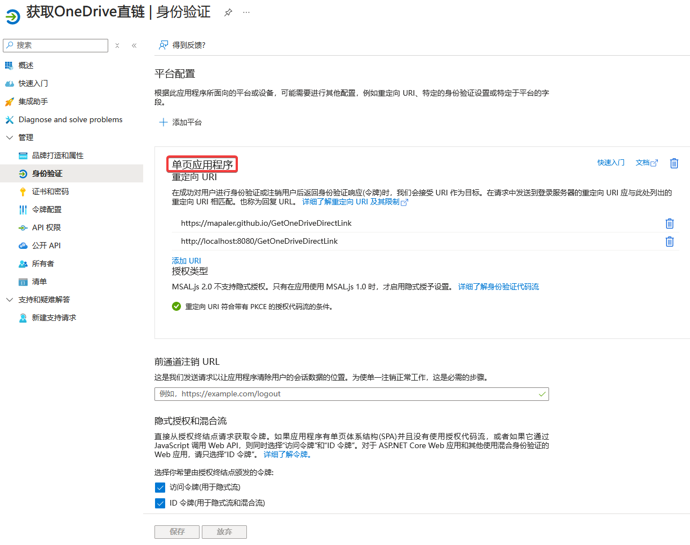

获取OneDrive直链
===========
本应用的目的是为了**批量**获取 OneDrive 直链，方便在其他站点外链。前身为[提取OneDrive直链地址工具](http://bbs.comicdd.com/thread-354826-1-1.html)的网页版，因为原来的工具失效了，软件版也不是那么好用了，因此决定使用 OneDrive 官方 SDK 来进行获取，确保不失效。 

2024年7月8日 以前的 SDK v7.2 好像用不了了，切换 SDK 到 v8 版本，只能获取到基本信息了。找了很久也不知道怎么获取更多的文件信息，就这样将就着用吧。

# 马上使用
https://mapaler.github.io/GetOneDriveDirectLink/

> 因为使用官方 API 直接访问 onedrive.live.com 选择文件，因此可能需要翻墙。

# 隐私声明

使用微软官方 [文件选取器 v8](https://learn.microsoft.com/zh-cn/onedrive/developer/controls/file-pickers/)，本应用不会得到你的账号密码和其他用户资料。
目前仅申请了 `Files.Read`、`Files.Read.Selected` 两个权限，SDK 只会返回用户选择的文件的信息，不会获得未授权的其他内容。  

# 如何自行搭建

## 文件选取器 v8 教程

我不想注册收费的 Azure，所以只提到在原有 v7.2 上的变化。注册 Azure 的流程区别请自己想办法了。

1. 身份验证不能用 Web ，得改成单页应用程序，不然会报错：[The provided request must include a 'client_secret' input parameter in the sample project](https://github.com/Azure-Samples/ms-identity-javascript-react-spa-dotnetcore-webapi-obo/issues/30)  

2. 应用 ID，替换本程序 `scripts/auth.js` 内的 `msalParams.auth.clientId`。

## JavaScript SDK v7.2 教程

2024年7月8日 目前时间点登录会显示以下警告，也就是需要迁移到收费的 Azure，我不想搞，所以以下自行搭建教程已不适用于目前的内容，就这样将就着用吧。

> 自 2020 年 6 月 30 日起，我们将不再向 Azure Active Directory 身份验证库(ADAL)和 Azure Active Directory Graph 添加任何新功能。我们将继续提供技术支持和安全更新程序，但将不再提供功能更新。应用程序将需要升级到 Microsoft 身份验证库(MSAL)和 Microsoft Graph。[了解更多信息](https://go.microsoft.com/fwlink/?linkid=2132805)

> 这些应用程序与帐户 xxxx@outlook.com 关联，但不包含在任何目录中。在目录外部创建应用程序的功能已被弃用。你可通过加入 [M365 开发人员计划](https://aka.ms/joinM365DeveloperProgram)或[注册 Azure](https://aka.ms/signUpForAzure) 来获取新目录。[了解详细信息](https://aka.ms/MsaDeprecateInfo)

### 原内容

>按照[OneDrive file picker SDK](https://docs.microsoft.com/onedrive/developer/controls/file-pickers/js-v72/)内的说明进行，由于旧有的*Microsoft 应用注册门户*已经迁移到*Azure门户*，特此做出更新，此版本更新于2020年2月6日。

1. 应用注册  
在 [Azure 门户](https://portal.azure.com/#blade/Microsoft_AAD_RegisteredApps/ApplicationsListBlade) 创建应用，自己申请一个应用 ID，然后替换本程序 `script.js` 内底部的 `clientId`。  
  
其中 `odOptions.advanced.queryParameters` 内容参见 [DriveItem 资源类型](https://docs.microsoft.com/onedrive/developer/rest-api/resources/driveitem?view=odsp-graph-online)，若不设定，将只返回基本信息。
1. 设置**身份验证**  
将网页的各种东西上传到你申请 ID 时设置的 重定向 URL 即可，页面 URL 不在重定向内会发生错误。注：这个页面必须为 https（仅 localhost 可为 http，且 localhost 也需添加到 重定向 URL）  
需要勾选**隐式授权**的**访问令牌**、**ID 令牌**。*讨论见[#9](//github.com/Mapaler/GetOneDriveDirectLink/issues/9)*

1. 设置**API 权限**  
添加 `Microsoft Graph` ▶ `委托的权限` ▶ `Files.Read`、`Files.Read.Selected`  
 

## 原理
`http://storage.live.com/items/文件ID` 是很早之前就流传的 SkyDrive 官方的真实直链重定向地址，出处不可考。  
开始一般是用`http://storage.live.com/items/文件ID?filename=xxx.jpg`来外链图片，后面的文件名用来欺骗DiscuzX论坛系统，但是浏览器下载该文件还是没有正确文件名。  
后来有高手发现的`http://storage.live.com/items/文件ID:/xxx.jpg`这个地址格式不会影响 SkyDrive 识别ID，还同时可以欺骗浏览器为普通文件地址，识别出文件的文件名与扩展名。  
访问 `onedrive.live.com` 域名需要翻墙，但是生成的 `storage.live.com` 链接不需要。

### 1drv.ws 原理

> 由于 *1drv.ws* 项目自身停止运行，已删除对此功能的支持

**1drv.ws** 是 *[The OneDrive Direct Download Link Helper](//github.com/aploium/OneDrive-Direct-Link)* 项目的实现。  
原理为
1. 获取OneDrive的分享链接 `https://1drv.ms/u/分享ID`
2. 重定向到 `https://onedrive.live.com/redir?resid=文件ID&authkey=通行证`
3. 将访问网页的地址修改为下载地址 `https://onedrive.live.com/download?resid=文件ID&authkey=通行证`
4. 再次重定向到真实CDN地址 `https://public.ch.files.1drv.com/很长一串字符/文件名?download&psid=1`

其中，对 `onedrive.live.com` 的重定向需要墙外后端支持。

在 OneDrive SDK 中，使用 `share` 操作才能新增并获取到分享链接，因此添加了“额外创建分享链接”按钮。  
掩码将获取到的分享链接中的 1drv.**m**s 修改为 1drv.**w**s ，即可得到下载链接。但是这种方式的 http header `content-Dispositong` 值为 `attachemen` 会弹出下载窗口，而不是内部预览。